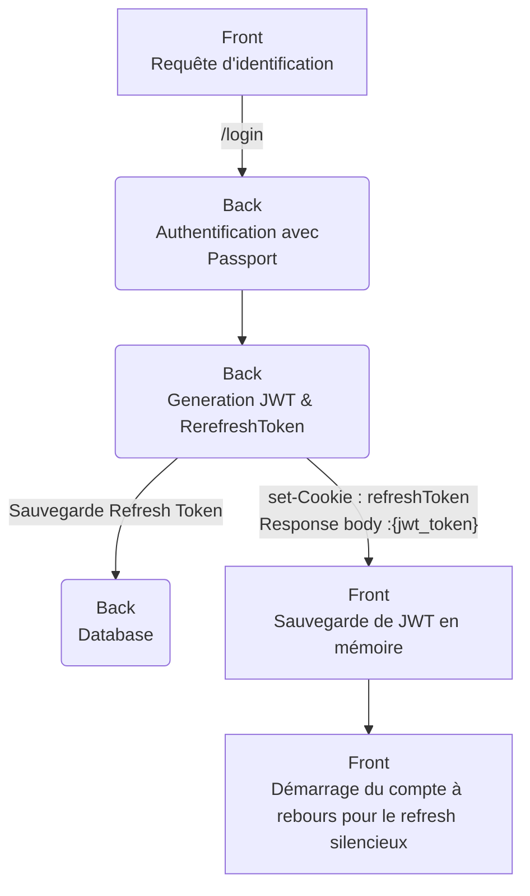

# MASK (MERN Auth StarterKit)
Ceci est un projet starterkit basé sur le stack MERN.

Le point de départ de ce projet a été mon souhait de travailler sur un "vrai" projet React afin d'aller plus loin que les simples tutos et formations que j'ai pu suivre. Ce projet se veut être le point de départ de futures applications.

Vous trouverez donc proprobablement dans ce projet des defauts d'implémentaion, des Best practices non respectés (car non connu), un manque évident de commentaires (surtout au début du projet), une organisatino un peu brouillone...
N'hésitez pas à me signaler votre point de vue sur ce sujets, et  je me ferais un plaisir de me corriger si je juges vos arguments convainquant.

Rendons à César ce qui est à Cesar, J'ai initié ce projet en me basant sur un article traitant du sujet des token et refreshToken JWT avec MERN:

https://www.codingdeft.com/posts/react-authentication-mern-node-passport-express-mongo/#why-both-jwt-and-refresh-tokens-and-what-is-silent-refresh

## Objectif du projet
L'objectif du projet est d'implémenté un maximum de technique d'authentification comme :

- [X] login + mot de passe avec token  et refreshToken Jwt 
- [X] Mfa via jeton TOTP
- [ ] Mail d'activation de compte afin de valider l'authenticité du mail.
- [ ] Mfa via code recue par email
- [ ] Mfa via code recue sms
- [ ] Mfa par approbation via Microsoft ou google authenticator
- [ ] MagicLink 
- [ ] social Network (google, Facbook, X, Microsoft,....)
- [ ] Appareil de confiance
- [ ] code Pin de windows
- [ ] Detection des "anomalies"  (connexion depuis un eutre appareil, depuis un autre pays)
- [ ] ......

Dans le futur, j'aimerais implémenter d'autres features plus éloignés de l'authentification mais dont je vois un intéret pour un projet de ce type :
- [x] Internationalisation de l'app
- [X] Switch Theme sombre light
- [ ] ajout d'un système de role
- [ ] ajout d'un systeme de groupe (groupe d'utilisateur, groupe de groupe...) pour egrouper des utlisateurs sous une même entité par exemple
- [ ] un backoffice pour gérer les users, les groupes, dashboard

Dans un premier temps, je vais essayer d'implémenter ces features.
Dans un dexuième temps, je rendrais le projet modulaire au travers d'un fichier de config afin de choisir ce que l'on veut activer ou pas comme feature.

## Prérequis
C'est un projet avec le stack MERN (Mongodb Epress React Node), il vous faut donc :
* un editeur de code (VSCode ou autres)
* un serveur MongoDB (on premise, sous docker, sur MongoDB Atlas   bref un serveur mongodb )
* NodeJs 
* React 
* Express

## Explication des implémetations
- [X] login + mot de passe avec token  et refreshToken Jwt
flux pour l'identification

## Outils utlisés pour ce projet
IDE :

VS code + Plugin VS code : 
*   Markdown All in One ( pour la redaction des README)
*   GitHub Copilot et GitHubCopilotChat
*   MongoDB for VS Code
*   SonarLint

Librairie utlisé :
* PassportJS (authentification)
* BluePrint (UI)
* i18n (Intertionalisation)
* Liste à compléter
* ...

IA :
* Github Copilot
* [chat](https://chat.mistral.ai)

