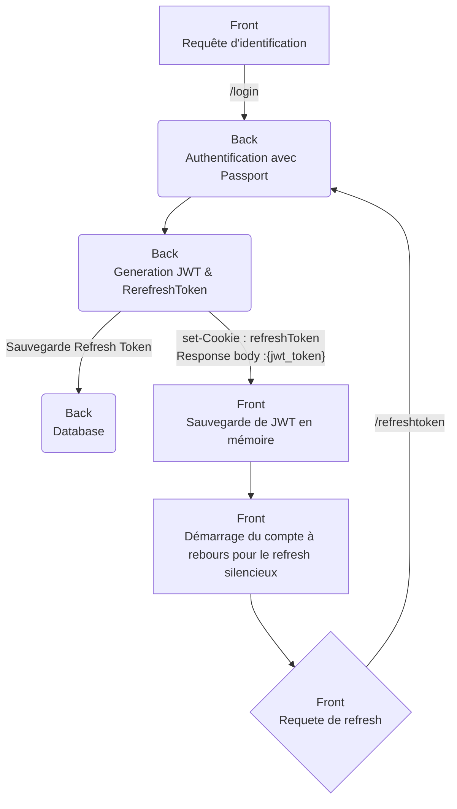

# MASK (MERN Auth StarterKit)
Ceci est un projet starterkit basé sur le stack MERN.

L'initiation de ce projet est née du désir de travailler sur un projet React concret, afin d'approfondir mes connaissances au-delà des simples tutoriels et formations suivis. 

Ce projet a pour objectif de fournir une base solide pour les futures applications basées sur le stack MERN. Bien que j'ai fait des efforts pour respecter les meilleures pratiques, il est possible que certaines imperfections subsistent, telles que des défauts d'implémentation, une organisation perfectible ou un manque de commentaires dans le code. Je suis ouvert à toute remarque constructive visant à améliorer la qualité du projet.

N'hésitez pas à me faire part de votre point de vue sur ces sujets, et je prendrai en compte vos arguments pour apporter les corrections nécessaires.

Rendons à César ce qui est à Cesar, J'ai initié ce projet en me basant sur un article traitant du sujet des jetons et jetons de réinitialisation JWT avec MERN. Je vous invite à consulter cet article pour en savoir plus sur les concepts abordés dans ce projet :

https://www.codingdeft.com/posts/react-authentication-mern-node-passport-express-mongo/#why-both-jwt-and-refresh-tokens-and-what-is-silent-refresh

## Objectif du projet
L'objectif du projet est d'implémenter un maximum de technique d'authentification comme :

- [X] login + mot de passe avec token  et refreshToken Jwt 
- [X] Mfa via jeton TOTP
- [ ] Mail d'activation de compte afin de valider l'authenticité du mail.
- [ ] Mfa via code recue par email
- [ ] Mfa via code recue sms
- [ ] Mfa par approbation via Microsoft ou google authenticator
- [ ] MagicLink 
- [ ] social Network (google, Facbook, X, Microsoft,....)
- [ ] Appareil de confiance
- [ ] code Pin de windows
- [ ] Detection des "anomalies"  (connexion depuis un eutre appareil, depuis un autre pays)
- [ ] ......

À l'avenir, j'envisage d'ajouter des fonctionnalités supplémentaires qui ne sont pas directement liées à l'authentification, mais qui pourraient s'avérer utiles pour un projet de ce type. Parmi ces fonctionnalités, on peut citer :
- [x] Internationalisation de l'app
- [X] Switch Theme sombre light
- [ ] ajout d'un système de role
- [ ] ajout d'un systeme de groupe pour regrouper des utilisateurs, avec des fonctionnalités telles que la création de groupes et de sous-groupes, la gestion des autorisations, etc
- [ ] un backoffice pour gérer les users, les groupes, dashboard

Dans un premier temps, je prévois d'implémenter ces features.

Dans un dexuième temps, je ptévois de rendre le projet modulaire au travers d'un fichier de configuration. Cela permettra aux utilisateurs de choisir les fonctionnalités qu'ils souhaitent activer ou désactiver.

## Prérequis
C'est un projet avec le stack MERN (Mongodb Epress React Node), il vous faut donc :
* un editeur de code (VSCode ou autres)
* un serveur MongoDB (on premise, sous docker, sur MongoDB Atlas   bref un serveur mongodb )
* NodeJs 
* React 
* Express

## Explication des implémetations
- [X] login + mot de passe avec token  et refreshToken Jwt
flux pour l'identification

## Outils utlisés pour ce projet
IDE :

VS code + Plugin VS code : 
*   Markdown All in One ( pour la redaction des README)
*   GitHub Copilot et GitHubCopilotChat
*   MongoDB for VS Code
*   SonarLint

Librairies utlisées :
* [React](https://fr.legacy.reactjs.org/)
* [PassportJS](https://www.passportjs.org/) (authentification)
* [BluePrintJs](https://blueprintjs.com/) (UI)
* [i18next](https://www.i18next.com/) (Intertionalisation)
* ...

IA :
* Github Copilot
* [chat mistral](https://chat.mistral.ai)

